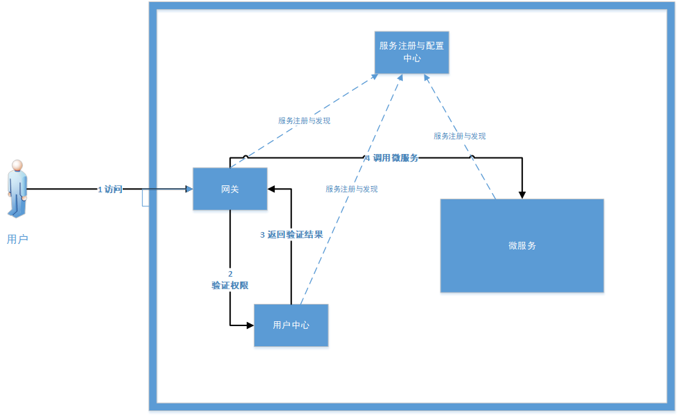

# cloud
 基于springcloud的分布式系统。
 本系统还在建设初期，
 本系统计划做成一个功能全面的基础架构。

 # 子系统组成

* [用户&权限中心](https://github.com/HideoutGroup/user-auth-service)
* [前端](https://github.com/HideoutGroup/web)
* [网关](https://github.com/HideoutGroup/gateway)
* [服务注册与配置中心](https://github.com/HideoutGroup/reg-config-service)

 ## 架构图

  

